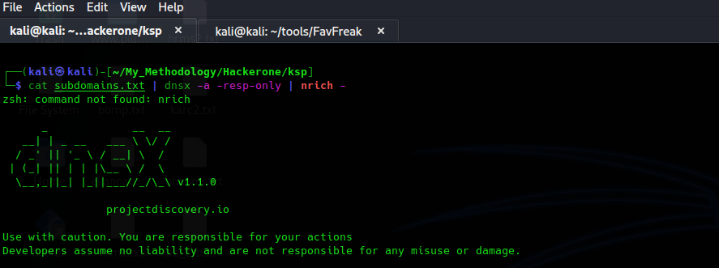

# Best Recon Technique For Active Subdomain Enumeration

\
In this article, we will explore some effective reconnaissance techniques that can assist you in discovering valuable information. Let's dive into these techniques for a comprehensive recon experience.

<mark style="color:green;">**Technique 1:**</mark> Active Subdomain Enumeration Active subdomain enumeration is a powerful technique often overlooked in favor of passive methods. There are two ways to perform active subdomain enumeration:

1. <mark style="color:green;">Brute Forcing Subdomains Using Wordlist:</mark> By utilizing a DNS wordlist and tools like FFuF and Best DNS Wordlist, you can effectively brute force subdomains. Execute the following command:

```
Command: ffuf -u “https://FUZZ.target.com" -w <path_to_wordlist> -mc 200,301,302,403
```

<figure><figcaption><p>Active Subdomain Enumeration Using FFUF</p></figcaption></figure>

<mark style="color:green;">Permutation Brute force</mark>: Create a new list of resolved subdomains by employing permutation, mutation, and alteration techniques with a wordlist. The tool altdns simplifies this process. Execute the following command:

```markup
Command: altdns -i hackerone.txt -o data_output -r -s final.txt -w words.txt
```

<figure><figcaption><p>Active Subdomain Enumeration Using FFUF</p></figcaption></figure>

<mark style="color:green;">Technique 2:</mark> Favicon Hashes Favicons, the icons representing your website, possess unique hash values that can aid in discovering domains sharing the same hash function. Use the FavFreak tool to calculate favicon hashes. Execute the following command:

```
Command: cat urls.txt | python3 favfreak.py
```

<figure><figcaption><p>Favicon hash detecting using FavFreak</p></figcaption></figure>

Once the hash is calculated, you can use the same on internet search engines such as **shodan** to get the mass websites.

<figure><figcaption><p>Using shodan Search Engine to detect site that have same favicon hashed</p></figcaption></figure>

More About this Tool [here](https://medium.com/@Asm0d3us/weaponizing-favicon-ico-for-bugbounties-osint-and-what-not-ace3c214e139).

<mark style="color:green;">Technique 3</mark>: Nrich is an excellent command-line tool for analyzing IPs in a file for CVEs, open ports, and vulnerabilities. Note that Nrich only accepts IP addresses as input, not domain names. To find IP addresses of hostnames, use the dnsx tool. Execute the following command:

```
command: cat subdomains.txt | dnsx -a -resp-only | nrich -
```

<figure><figcaption><p>use a nrich tool to check out the subdomains </p></figcaption></figure>

<mark style="color:green;">Technique 4:</mark> Choosing the Right Target When dealing with applications that have numerous subdomains, selecting the right subdomain to start hunting can be challenging. Utilize the interesting subs gf pattern list to identify interesting subdomains worth investigating. Execute the following command:

```
cat subdoma.txt | gf interestingsubs
```

<figure><figcaption><p>gf interestingsubs <strong>pattern list to find interesting subdomains</strong></p></figcaption></figure>

####

<figure><figcaption><p>Performing whoislookup on target domain</p></figcaption></figure>


<figure><figcaption><p>Searching For Tech Emails</p></figcaption></figure>

<mark style="color:green;">Technique 5</mark>: Reverse Whoislookup Performing a WHOIS lookup on a target domain and checking for Tech Emails can provide WHOIS registration results. This information can be utilized to gather all assets associated with an organization. Follow these steps: A. Perform a WHOIS lookup on the target domain and check for Tech Emails. B. Visit drs.whoisxmlapi.com, sign up/login (500 free credits initially), and search with the Tech Email to discover all assets belonging to the target organization.

<mark style="color:green;">Technique 6</mark>: Uncover, a powerful tool developed by the Projectdisovery team, enables you to swiftly discover exposed hosts on the internet. It leverages Shodan, Censys, and Fofa for host discovery. To make the most of Uncover, create a dorks list and provide it as input. Execute the following command:

```
Command: cat dorks.txt | uncover
```

<figure><figcaption><p>uncover tool link <a href="https://github.com/projectdiscovery/uncover">https://github.com/projectdiscovery/uncover</a></p></figcaption></figure>


: Finding Hidden Paths Using Meg Discovering hidden paths or directories is a crucial reconnaissance technique. Meg is a powerful tool that facilitates quick and efficient directory brute-forcing without overwhelming network traffic. Execute the following command:

```
Command: meg paths.txt hosts.txt output
```

<figure><figcaption><p>File List Created for the host xyz.com with request and response</p></figcaption></figure>

<mark style="color:green;">Technique 8</mark>: Finding Open Ports and Services Identifying open ports and services running on them is essential for web application assessment. Naabu is a fast port scanner that simplifies the process and even allows running Nmap scans. Execute the following command:

```
Command: naabu -host target.com
```

<figure><figcaption><p>Finding open ports and service running using naabu</p></figcaption></figure>

:clap:Thank you for taking the time to explore these amazing reconnaissance techniques. :smile:We hope you found this blog informative and useful in your endeavors.
