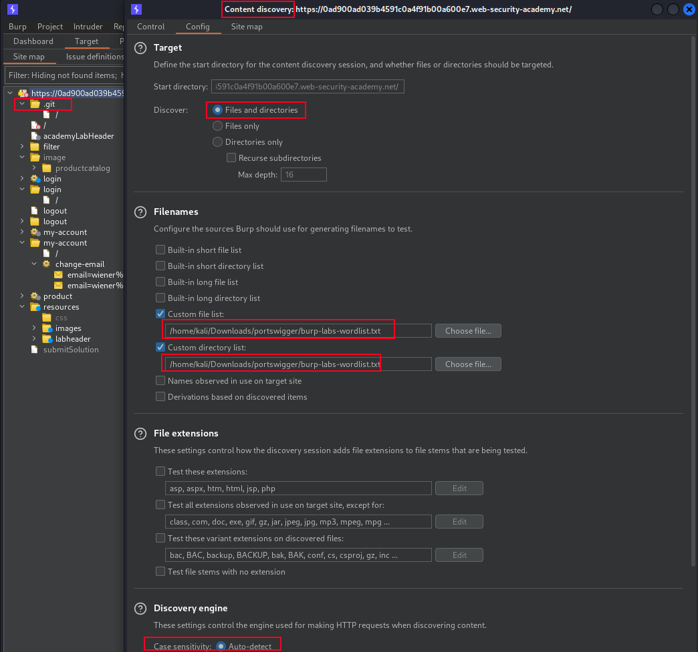

# ⚓ Comprehensive Guide to Web Content Discovery: Tools, Techniques, and Tips

```markdown
Here's the list of content discovery tools:

1. [gobuster](https://github.com/OJ/gobuster) - Directory/File, DNS, and VHost busting tool written in Go.
2. [recursebuster](https://github.com/C-Sto/recursebuster) - Rapid content discovery tool for recursively querying webservers, useful in pentesting and web application assessments.
3. [feroxbuster](https://github.com/epi052/feroxbuster) - A fast, simple, recursive content discovery tool written in Rust.
4. [dirsearch](https://github.com/maurosoria/dirsearch) - Web path scanner.
5. [dirsearch](https://github.com/evilsocket/dirsearch) - Go implementation of dirsearch.
6. [filebuster](https://github.com/henshin/filebuster) - Extremely fast and flexible web fuzzer.
7. [dirstalk](https://github.com/stefanoj3/dirstalk) - Modern alternative to dirbuster/dirb.
8. [dirbuster-ng](https://github.com/digination/dirbuster-ng) - C CLI implementation of the Java dirbuster tool.
9. [gospider](https://github.com/jaeles-project/gospider) - Gospider is a fast web spider written in Go.
10. [hakrawler](https://github.com/hakluke/hakrawler) - Simple, fast web crawler designed for easy and quick discovery of endpoints and assets within a web application.
11. [crawley](https://github.com/s0rg/crawley) - Fast, feature-rich unix-way web scraper/crawler written in Golang.

```

<figure><figcaption><p>Credits to Respected creator.</p></figcaption></figure>

Certainly! Content discovery is an essential phase in web security testing. It involves searching for hidden paths and files on a target website. Here's an elaboration of the content discovery process, along with creative examples and additional tools:

**1. Using Burp Engagement Tools:**

Burp Suite is a popular web security testing tool that provides various features for content discovery. In this method, we leverage Burp's engagement tools and content discovery options to find hidden paths and files.

* Open Burp Suite and navigate to the "Target" tab.
* Right-click on your target website and select "Engagement Tools."
* In the Engagement Tools dialog, go to the "Content Discovery" section.
* Here, you can load custom wordlists or use built-in ones to discover hidden paths and files.
* Start the content discovery process.

**2. Using FFUF (Fuzz Faster, U Fool):**

FFUF is a versatile and fast web fuzzing tool that allows you to enumerate web directories and files efficiently. Here's how to use it:

* First, make sure you have FFUF installed. You can find it on GitHub: https://github.com/ffuf/ffuf
* Download a wordlist for content discovery. You can use the Burp Labs wordlist as mentioned in your initial example.

```bash
wget https://raw.githubusercontent.com/botesjuan/Burp-Suite-Certified-Practitioner-Exam-Study/main/wordlists/burp-labs-wordlist.txt
```

* Use FFUF to enumerate directories and files on the target website:

```bash
ffuf -c -w ./burp-labs-wordlist.txt -u https://TARGET.web-security-academy.net/FUZZ
```

In this command:

* `-c`: Colorize the output for better readability.
* `-w`: Specify the wordlist file you downloaded.
* `-u`: Set the target URL with `FUZZ` as a placeholder for the paths and files to be fuzzed.

**Creative Examples and Tips:**

*   **Fuzzing for Common Paths:** You can use FFUF with wordlists containing common directory and file names to discover hidden resources. For example:

    ```bash
    ffuf -c -w common-paths.txt -u https://TARGET.web-security-academy.net/FUZZ
    ```
* **Checking `robots.txt` and `sitemap.xml`:** Always check the `robots.txt` and `sitemap.xml` files on a website. These files often reveal directories and paths you might want to explore.
*   **Recursive Directory Enumeration:** FFUF can perform recursive directory enumeration by specifying multiple `FUZZ` placeholders. For instance:

    ```bash
    ffuf -c -w common-paths.txt -u https://TARGET.web-security-academy.net/FUZZ/FUZZ
    ```
* **Custom Wordlists:** You can create custom wordlists tailored to the target website based on its content, industry, or previous vulnerabilities.
* **Useful FFUF Flags:** Explore FFUF's flags such as `-e` for extensions, `-recursion` for recursion, and `-mc` for matching a specific HTTP status code.
* **Content Discovery Automation:** You can automate content discovery as part of your reconnaissance process and periodically check for new content.

Remember that content discovery should always be conducted responsibly and with proper authorization. Unauthorized scanning or testing of websites may be illegal and unethical. Always follow ethical guidelines and obtain permission when conducting security testing.
